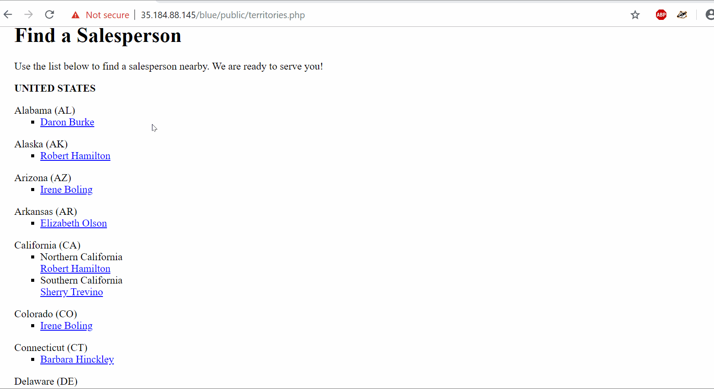
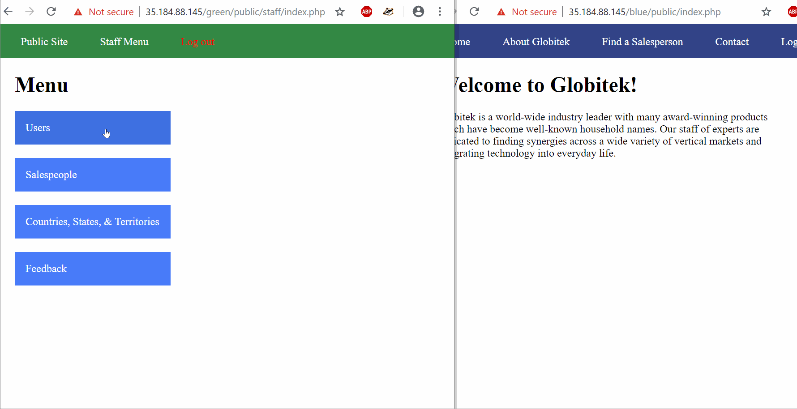
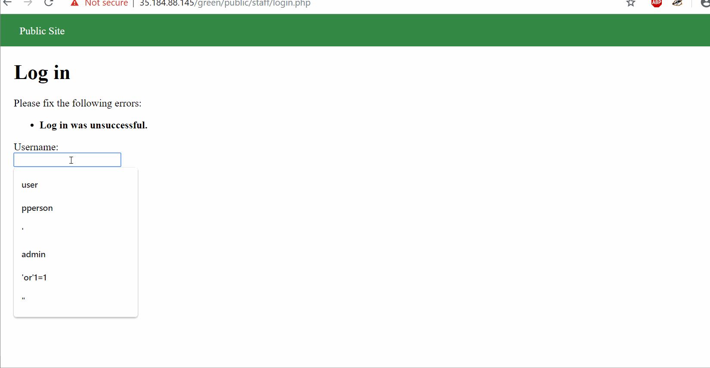
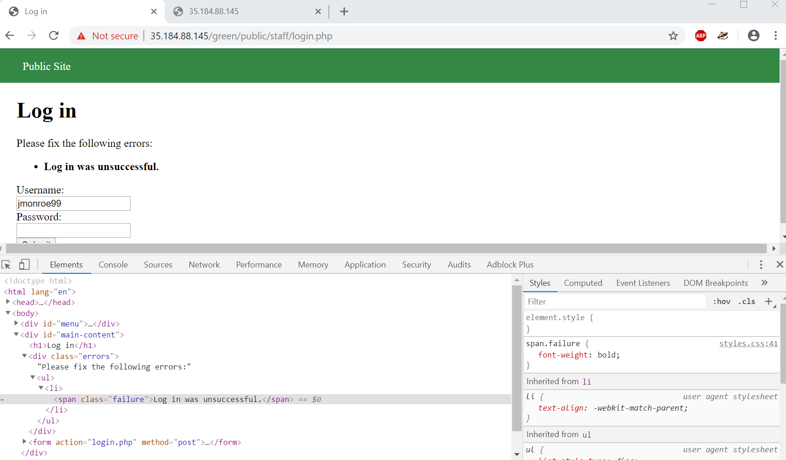
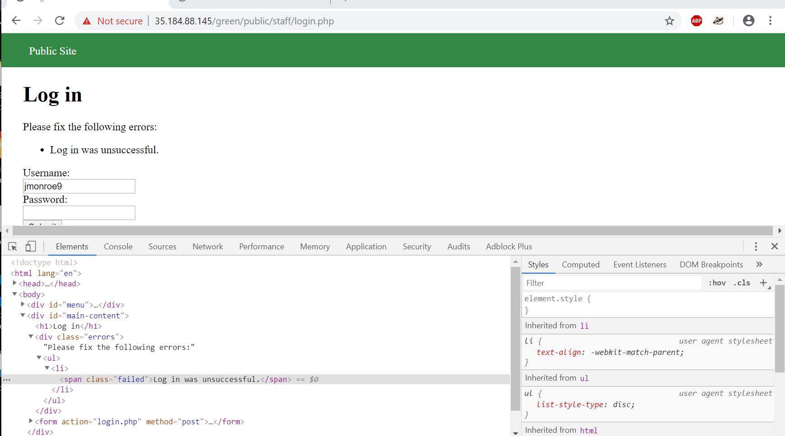
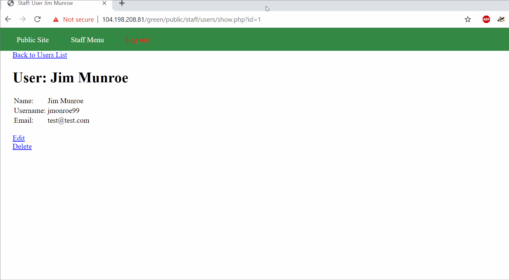
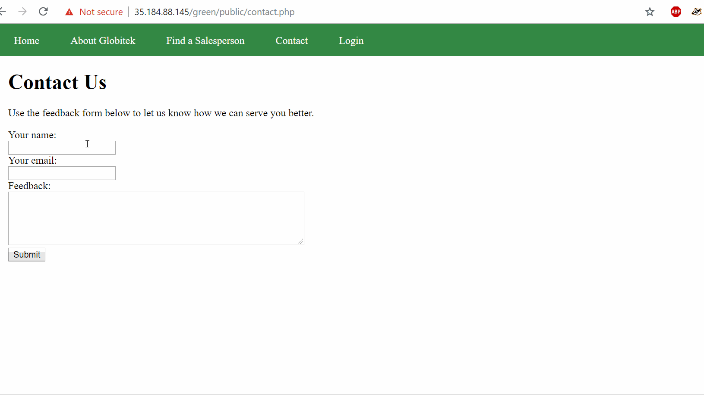
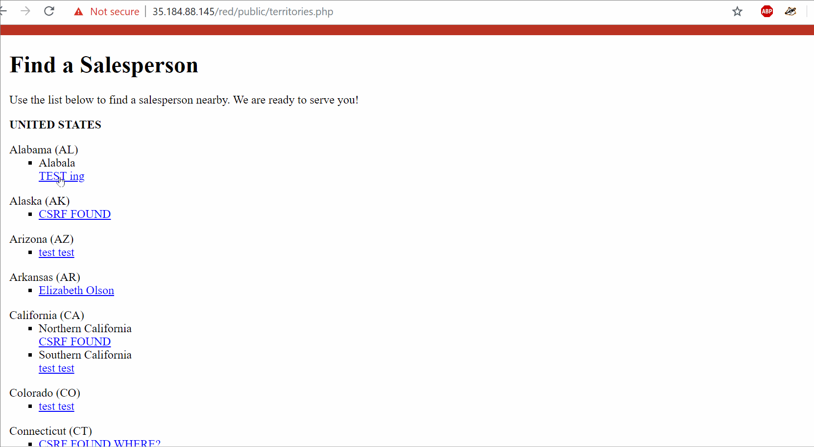
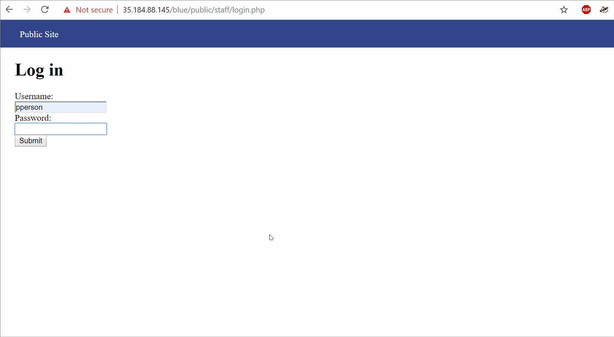

# week9-Penetrating-live-test
# Project 8 - Pentesting Live Targets

Time spent: **7** hours spent in total

> Objective: Identify vulnerabilities in three different versions of the Globitek website: blue, green, and red.


## Blue

### Vulnerability #1: SQLI
* The user can inject SQL code into the website by changing userID to 
```
OR SLEEP(5)=0--'
```
* That make the website to slow down, the greater the value inside SLEEP, it will slow more.




### Vulnerability #2: Session HighJacking

* In the blue site, One can get into the system by highjacking the session ID
* I get the sessionID while logging in from the green site and note the sessionID, I cleared the cookie to make sure it work.
* I looged in blue site from another browser and changed the session ID while I was trying to log in and BOOM I am in.




## Green


### Vulnerability #1:: Username Enumeration
* The login page show the bold " Login was Unsuccessful" when entered the username which is in the database
* Otherwise it will be normal which make the person to find out the user which exist in the system





### Vulnerability #2: Indirect Object Refrence 
* By change the id value on the webaddress, one can view the info of the staff which is not displayed normally
```
https://104.198.208.81/green/public/staff/users/edit.php?id=2 
```


### Vulnerablity #3: Cross-Site Scripting 
* While fillin the contact us form in the greensite homepage, in the feedback form we can put script as below

```
<script>alert('Ok then, How about this?')</script>

```
* Below is the gif walkthrough



## Red

### Vulnerability #1: Insecure Direct Object Reference (IDOR)

* One can access the information of salesman who is not in the list by setting ID to 10 or 11



### Vulnerability #2: Cross-Site Request Forgery (CSRF)

* The user has permissions to update info in the site with the csrf token.
* The red one also act as the blue page which dont allow the user to edit without the valid token.


## Notes
Yeah, it really have to work really hard but at the end it was good feeling.
